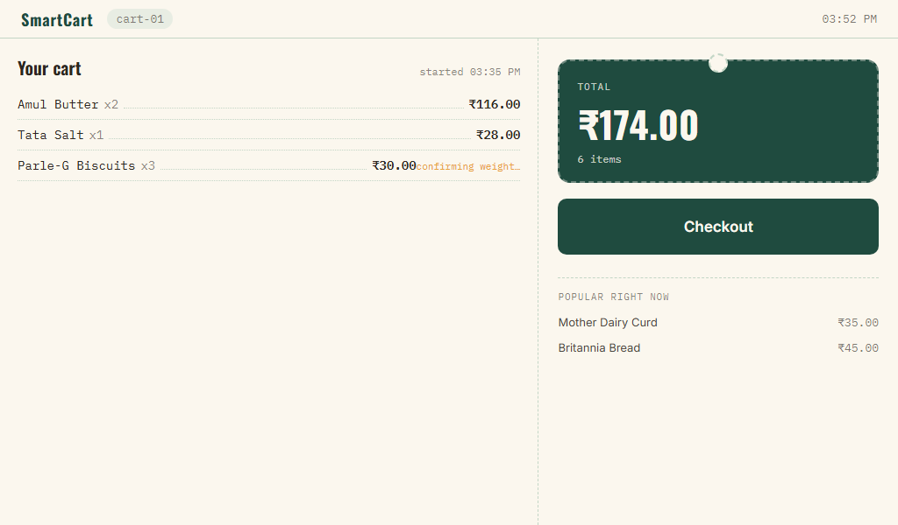

# SmartCart

An IoT-enabled smart shopping cart: camera-based item detection, load-cell weight verification, a shopper-facing touchscreen, and an authenticated admin dashboard with live session monitoring and purchase-history-driven recommendations — built on a FastAPI + PostgreSQL backend.

---

## Project Overview

SmartCart automates in-cart item recognition and checkout. A Raspberry Pi camera detects items placed in the cart; an ESP32-driven load cell independently verifies the detection against a physical weight change; a 7" touchscreen shows the shopper their running total and checkout flow; and store staff get a live, authenticated dashboard of every active cart plus catalog management and sales analytics.

This repository is the result of a full rebuild of an earlier prototype. The original code (kept for reference in `legacy/`) talked directly to Firebase with no security rules, supported exactly one hardcoded cart session system-wide, and had no shopper-facing interface at all. Every component here was rebuilt against a shared backend, with real security boundaries, and tested — see `docs/` for the full analysis and testing record behind these claims.

## Features

- **Camera-based item detection** (Raspberry Pi + Pi Camera V2), with per-product cooldown and catalog-to-model validation that catches undetectable product mappings at startup instead of failing silently.
- **Independent weight verification** (ESP32 + HX711 load cell), comparing the weight *delta* since the last reading against the most recently detected item — not a running total.
- **Shopper touchscreen UI** — login, live cart view, checkout/receipt, and a purchase-history-based "you might also like" panel.
- **Admin dashboard** — authenticated; live session monitoring, full product catalog CRUD, shopper account management, and a store analytics summary.
- **Recommendations & analytics** — frequently-bought-together and personalized suggestions from real SQL aggregation over closed-session purchase history, with explicit, honest cold-start handling (never silently presenting a generic list as personalized).
- **No Firebase** — a single FastAPI + PostgreSQL backend is the source of truth for every device.

## Hardware

| Component | Role |
|---|---|
| Raspberry Pi 4 | Main controller: backend, detection, touchscreen kiosk |
| ESP32 dev board | Load-cell sensing, weight reporting |
| 7" Capacitive Touch LCD (HDMI + USB) | Shopper-facing display |
| 50 kg Load Cell + HX711 | Cart weight sensing |
| Pi Camera Module V2 (8MP) | Item detection |
| 11.1V 5200mAh 3S Li-ion battery + XL4015 buck converter | Portable power |
| 3S Li-ion charger (12.6V 2A) | Battery maintenance |

Full component-by-component analysis, alternatives considered, and integration notes: `docs/Phase2_Hardware_Analysis.md`.

## Software Stack

- **Backend:** Python, FastAPI, SQLAlchemy, PostgreSQL, Docker Compose
- **Detection:** Python, OpenCV / picamera2, MobileNet-SSD (Caffe)
- **Firmware:** C++ (Arduino/ESP32 core), HX711 library, ArduinoJson
- **Frontends:** Plain HTML/CSS/JavaScript — no build step, no framework, on both the kiosk UI and admin dashboard

## Installation

```bash
git clone <this-repo>
cd SmartCart/backend
cp .env.example .env        # fill in real secrets — see backend/README.md
docker compose up -d --build
python3 seed_products.py --token <admin_jwt_from_login>
```

Then set up each remaining component against the running backend — see the README in each folder for full instructions:

- `firmware/README.md` — ESP32 setup, wiring, load-cell calibration
- `detection/README.md` — Raspberry Pi camera setup, model download
- `kiosk-ui/README.md` — touchscreen kiosk launch instructions
- `admin-dashboard/README.md` — admin dashboard setup and first sign-in

## Build Instructions

See `firmware/README.md` for flashing the ESP32 (Arduino IDE or `arduino-cli`, library dependencies listed there). All other components are either Python (no compilation) or static web files (no build step).

## Usage

1. Admin creates the product catalog and shopper accounts via the admin dashboard.
2. A shopper enters their 8-character login code on the cart's touchscreen.
3. Items placed in the cart are detected by the camera and cross-verified by the load cell.
4. The touchscreen shows the live cart and running total; the admin dashboard shows the same cart, live, to staff.
5. Shopper taps Checkout; an itemized receipt is generated and the session closes.

## Architecture

```
Raspberry Pi 4                          ESP32
├── backend    (FastAPI + Postgres)     ├── firmware  (HX711 load cell,
├── detection  (camera detection)       │   HTTP to backend)
└── kiosk-ui   (7" touchscreen)

Admin's laptop/desktop
└── admin-dashboard (sessions, analytics, products, shoppers)
```

Every component talks to the backend over authenticated HTTP/REST. Full architecture diagrams (deployment, sequence, and component views, including Mermaid sources) are in `docs/SmartCart_Technical_Report.docx`, Section 6.

## API Documentation

Interactive API docs are auto-generated by FastAPI at `http://<backend-host>:8000/docs` once the backend is running. A full endpoint reference table (auth requirements and callers) is in `backend/README.md` and in the Technical Report, Section 8.6.

## Future Scope

- Real hardware measurements to replace the estimated performance figures in the Technical Report.
- A custom-trained product detection model, once a labeled product image dataset exists.
- A four-corner load-cell platform to reduce off-center-loading measurement error.
- Real payment gateway integration at checkout.
- Object tracking to distinguish a re-entered item from a genuinely new one.

Full future-scope discussion: Technical Report, Section 14.

## Images

The image gallery in `docs/UI_images.md` shows the current kiosk UI and the planned slots for the prototype hardware photos:



Add the remaining uploaded photos to `docs/images/` using the filenames listed in `docs/UI_images.md` so the kiosk, firmware, and hardware docs can display the full build record.

## Documentation

- `docs/Phase1_Repository_Analysis.md` — original prototype analysis
- `docs/Phase2_Hardware_Analysis.md` — hardware component analysis
- `docs/Implementation_Plan.md` — architecture decisions and milestone plan
- `docs/SmartCart_Technical_Report.docx` — full technical report (architecture, hardware, software, database, CV, embedded, testing, performance, future scope)
- `docs/SmartCart_Contribution_Report.docx` — engineering development log
